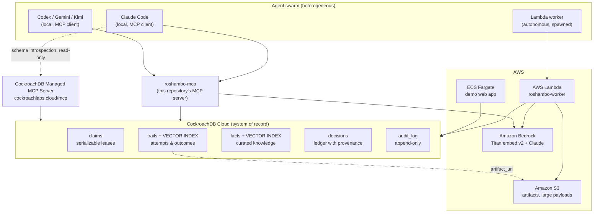

# Roshambo

**the multi-agent coordinator**

**[Deutsche Fassung / German version: README_de.md](README_de.md)**


**Three agents throw at the same time. Exactly one wins.
Not by luck — by a serializable transaction.**

Roshambo is the English name for the game of rock-paper-scissors: everyone throws at
the same time, and exactly one throw wins. That is the shape of the problem this
project solves for agent swarms — except here, the winner is not decided by chance, it
is decided by a serializable transaction in CockroachDB.

> Roshambo is a multi-agent coordinator. CockroachDB is the system of record:
> serializable leases so two agents never claim the same work, and a distributed
> vector index so an agent can ask, before it starts, "has anyone tried this — and
> how did it end?"

Roshambo's second characteristic, alongside coordination, is **negative memory**: it
does not primarily store documents or conversations, it stores the *outcomes of
attempts* — failures included — and makes it possible to find the earlier attempt again
later, even when a new query is worded differently than the original entry. A human
remembers their own dead ends; a freshly spawned agent does not, unless something wrote
it down. (This is vector search over embeddings — see [Known limitations](#known-limitations)
for exactly what has and has not been verified about how well it captures meaning versus
vocabulary.)

Built for the [CockroachDB x AWS Hackathon: Build with Agentic Memory](https://cockroachdb-ai.devpost.com/)
(Cockroach Labs, managed by Devpost).

## Positioning: a multi-agent coordinator, not an agent-memory product

Agent memory is not an open field. Several well-built, well-documented systems already
cover it:

- **[Amazon Bedrock AgentCore Memory](https://docs.aws.amazon.com/bedrock-agentcore/latest/devguide/memory.html)**
  — a fully managed agent memory service: short-term event storage within a session,
  plus long-term memory extracted via configurable strategies (semantic, summarization,
  user-preference, episodic), retrievable by semantic search across sessions.
- **[`langchain-cockroachdb`](https://github.com/cockroachdb/langchain-cockroachdb)**
  (official) — a vector store and a LangGraph checkpointer (`CockroachDBSaver`,
  `AsyncCockroachDBSaver`) for thread-scoped agent state, on the same database Roshambo
  uses.
- **[Memori Labs × CockroachDB](https://www.cockroachlabs.com/blog/agent-memory-database-cockroachdb-memori/)**
  — a memory layer for agent facts, events, and embeddings, also built on CockroachDB.
- **[Amazon Bedrock Multi-Agent Collaboration](https://docs.aws.amazon.com/bedrock/latest/userguide/agents-multi-agent-collaboration.html)**
  — a supervisor pattern for up to 10 collaborator agents within one Bedrock account,
  with `conversationHistory` sharing between supervisor and collaborators.
- **[Claude Code Agent Teams](https://code.claude.com/docs/en/agent-teams)** — a shared
  task list, peer-to-peer messages, and file locking between teammates in one Claude
  Code session.

Roshambo does not compete with any of these on their own ground, and does not rebuild
what they already do well. **Roshambo is a multi-agent coordinator: the coordination
layer between agents that do not know about each other** — different vendors, different
machines, different sessions — plus the memory of how their attempts turned out.

| Property | Agent Teams | Bedrock Multi-Agent Collaboration | AgentCore Memory | Roshambo |
|---|---|---|---|---|
| Reach | one session, one process, one vendor | Bedrock agents inside one account | agents on AgentCore | cross-vendor, cross-machine |
| Coordination lifetime | ends with the session | conversation context | — | durable in the database, survives a process crash |
| What is coordinated | files in the team | tasks, supervisor to collaborator | — | any named resource (repos, files, cloud resources, datasets) |
| "Who is working on what", asked from outside | team-internal | team-internal | — | anyone involved can ask, including a human |
| Memory of attempt outcomes | no | no | conversation extraction | yes, retrievable by vector search even when reworded, failures included |

Honesty about the boundary: if what you actually need is conversation memory or
thread-scoped agent state, use the official integrations above — Roshambo does not
reimplement them, and it is complementary to them, not a replacement (the same
CockroachDB cluster can serve both at once).

**Why this gap stays open:** no vendor has an incentive to build coordination for its
competitors' agents. Agent Teams coordinates Claude Code sessions; Bedrock Multi-Agent
Collaboration coordinates Bedrock agents. Common practice, though, is to run several of
these tools side by side on the same project. That space between them — where an agent
built by one vendor needs to know what an agent built by another vendor already tried —
is the space Roshambo occupies.

## Why CockroachDB

The hackathon's central question is whether CockroachDB plays a meaningful,
production-grade role, not a swappable one. Roshambo needs two things at once, in
**one** database:

| Requirement | Why a vector store alone is not enough | Why a plain relational database alone is not enough |
|---|---|---|
| Two agents must never claim the same resource | Vector stores do not offer serializable transactions | — |
| "Has this been tried?" must be answered semantically | — | A database without a vector index only gives you full-text proximity |
| A claim (lease) and a memory (trail) must stay consistent with each other | A separate vector store creates exactly the "consistency gap" the hackathon brief warns about | Same problem, same direction |
| Agents spawn worldwide and write constantly | — | A single-region database becomes the failure point: "an agent whose memory goes offline doesn't degrade gracefully, it stops" |

That is a case that genuinely needs Serializable Isolation *and* a distributed vector
index together — not a case where CockroachDB is interchangeable with something else.

## Architecture



Two MCP paths onto the same cluster, deliberately kept separate:

- **CockroachDB Managed MCP Server** (`https://cockroachlabs.cloud/mcp`) — the
  human-adjacent path: schema introspection, ad-hoc analysis, read-only by default.
  See [`docs/mcp-managed.md`](docs/mcp-managed.md).
- **`roshambo-mcp`** (this repository) — the agent-adjacent path: a narrow, checked set
  of six verbs, no free-form SQL tool. See
  [Security](#security-no-free-form-sql-on-purpose) below.

## Status

This repository was built within a fixed hackathon submission window, with the core
data model, the AWS integration, and the agent interface developed in parallel as
separate workstreams. Each workstream keeps its own evidence log with commands that
were actually executed and their real output — read those before trusting a specific
claim anywhere in this README:

- Core data model, leases, recall: [`docs/EVIDENCE-core.md`](docs/EVIDENCE-core.md)
- AWS integration (Bedrock, Lambda, S3): [`docs/EVIDENCE-aws.md`](docs/EVIDENCE-aws.md)
- MCP server and Agent Skills: [`docs/EVIDENCE-iface.md`](docs/EVIDENCE-iface.md)

Implemented in this repository, with tests:

- CockroachDB schema (`claims`, `trails`, `facts`, `decisions`, `audit_log`) with a
  `VECTOR(1024)` index on `trails`/`facts`, prefixed by `swarm_id` — `schema/001_init.sql`
- The `Roshambo` client: `claim` / `release` / `remember` / `recall` / `decide` /
  `status`, plus `heartbeat`, `who_has`, `learn`, `reinforce` — `src/roshambo/memory.py`
- Embeddings: Amazon Titan Text Embeddings V2 via Bedrock, with an offline,
  explicitly-non-semantic fallback for development without AWS credentials —
  `src/roshambo/embeddings.py`
- `roshambo-worker`, an AWS Lambda handler implementing the claim -> recall -> work ->
  remember -> release cycle — `src/roshambo/aws/worker.py`
- S3 artifact storage for large trail/fact payloads — `src/roshambo/aws/s3.py`
- `roshambo-mcp`, the six-tool MCP server this document mostly describes —
  `src/roshambo/mcp/server.py`
- Agent Skills teaching an agent to use Roshambo correctly — `skills/`
- CI (`.github/workflows/ci.yml`): lint plus the credential-free test suite, on every
  push and pull request against `main`

Present in the tree and reported working by the AWS lane in direct testing, but not yet
written up in [`docs/EVIDENCE-aws.md`](docs/EVIDENCE-aws.md) as of this writing — treat
as believable, not yet as independently documented:

- Infrastructure-as-code / provisioning scripts (`infra/`) — Lambda packaging and
  deploy, IAM policy, `ccloud`-based cluster provisioning
- The demo web application (`demo/`) — a FastAPI service with a static frontend and a
  `mock`-mode fallback when no CockroachDB cluster is configured

Not yet started as of this writing:

- A hosted demo URL and the submission video

## Quickstart

Requires Python >= 3.10 and a reachable CockroachDB cluster (a local `cockroach demo`
/ `cockroach start-single-node` instance, or a CockroachDB Cloud cluster both work —
Roshambo only needs a standard PostgreSQL-wire DSN).

```bash
git clone <this-repository-url>
cd roshambo
pip install -e ".[dev]"          # add extras as needed: [aws] for boto3, [mcp] for the MCP server

export ROSHAMBO_DSN="postgresql://root@127.0.0.1:26257/roshambo?sslmode=disable"
export ROSHAMBO_SWARM_ID="demo"

roshambo init-schema     # creates tables and vector indexes; safe to re-run
roshambo status          # swarm=demo agents=0 active_claims=0 trails=0 failures=0 facts=0
```

Use `127.0.0.1`, not `localhost`, in the DSN: on at least one tested host `localhost`
resolved to `::1` first while a `start-single-node --listen-addr=localhost` cluster only
listens on `127.0.0.1`, adding a measured ~8 seconds of failed IPv6 handshake to every
connection (see [`docs/EVIDENCE-core.md`](docs/EVIDENCE-core.md)). Both addresses work;
one is far slower per connection.

`roshambo` is a deliberately narrow CLI over the same verbs as `roshambo-mcp` (`claim`,
`release`, `who-has`, `remember`, `recall`, plus `init-schema` and `status`) — see
`src/roshambo/cli.py`. There is no "run arbitrary SQL" subcommand there either.
`init-schema` also accepts `--repair-vector-indexes`, which rebuilds a vector index
whose operator class does not match what `recall()` queries with — needed only if
`trails`/`facts` were created by an older revision of `schema/001_init.sql`; see
[Known limitations](#known-limitations) for why that mismatch matters.

Run the MCP server directly (stdio transport):

```bash
roshambo-mcp
```

Connect it from Claude Code as a local stdio server, with the environment it needs:

```bash
claude mcp add --transport stdio roshambo \
  --env ROSHAMBO_DSN="postgresql://root@localhost:26257/roshambo?sslmode=disable" \
  --env ROSHAMBO_SWARM_ID="demo" \
  -- roshambo-mcp
```

Then, inside Claude Code, run `/mcp` to confirm it connected and lists six tools.

## Configuration

Everything is read from the environment under the `ROSHAMBO_` prefix
(`src/roshambo/config.py`), so the same configuration works in a shell, inside
`roshambo-mcp`, and inside a Lambda:

| Variable | Required | Default | Meaning |
|---|---|---|---|
| `ROSHAMBO_DSN` | yes | — | PostgreSQL-wire connection string to CockroachDB |
| `ROSHAMBO_SWARM_ID` | no | `default` | Tenant/prefix key; the leading column of every table's primary key and of the vector index |
| `ROSHAMBO_EMBEDDING_DIM` | no | `1024` | Vector dimension (must match the schema's `VECTOR(n)` columns) |
| `ROSHAMBO_LEASE_TTL_SECONDS` | no | `300` | Default claim lifetime |
| `ROSHAMBO_EMBEDDING_PROVIDER` | no | `bedrock` | Which embedder `roshambo.embeddings.get_embedder` selects |
| `ROSHAMBO_AWS_REGION` | no | `us-east-1` | Region for Bedrock and S3 calls |
| `ROSHAMBO_BEDROCK_MODEL_ID` | no | `amazon.titan-embed-text-v2:0` | Bedrock embedding model |
| `ROSHAMBO_S3_BUCKET` | no | unset | Bucket for artifact storage; required only if you use `put_artifact` |

## The six tools

`roshambo-mcp` exposes exactly these six verbs — no more, and no free-form query tool
besides `recall`'s embedded vector search:

| Tool | Purpose |
|---|---|
| `claim(resource, agent_id, intent, ttl_seconds?)` | Take an exclusive, serializable lease. A denial (`ClaimDenied`) names who holds it and what they intend — it is a normal result, not an error to retry blindly. |
| `release(claim_id)` | Free a claim so another agent can pick up the resource. |
| `remember(topic, approach, outcome, evidence, ...)` | Record what was tried and how it ended. `outcome` is one of `success` / `failure` / `abandoned` / `inconclusive` — failures are written exactly like successes. |
| `recall(query, limit?, outcomes?)` | Vector search over past trails — finds a prior attempt even when the query is worded differently than the original entry. Call this *before* `claim()` on anything not obviously routine. |
| `decide(question, choice, rationale, confidence, provenance, ...)` | Log a decision to the swarm-wide ledger. `provenance` is mandatory: whether a human was actually in the loop must never be guessed after the fact. |
| `status()` | A snapshot of the swarm: agent count, active claims, trails, failures, facts. |

## Which CockroachDB tool, for what

The hackathon asks submissions to use at least two of the four CockroachDB tools below
and to say what the agent actually did with them:

| CockroachDB tool | How Roshambo uses it | Where in this repository |
|---|---|---|
| **Distributed Vector Indexing** | `trails` and `facts` carry a `VECTOR(1024)` column with a `VECTOR INDEX` prefixed by `swarm_id`; `recall()` queries it with cosine distance (`<=>`) so an agent can check, before acting, whether an approach has already failed | `schema/001_init.sql`, `src/roshambo/memory.py` (`recall`), `tests/test_core_recall.py` |
| **CockroachDB Cloud Managed MCP Server** | The read-only inspection path for schema introspection and ad-hoc analysis, kept deliberately separate from `roshambo-mcp`'s narrow write path | [`docs/mcp-managed.md`](docs/mcp-managed.md) |
| **Agent Skills Repo** | Roshambo ships its own skills in the same `SKILL.md` format as `cockroachlabs/cockroachdb-skills`, and documents installing that repository alongside them | `skills/`, [`docs/skills.md`](docs/skills.md) |
| **ccloud CLI** | Planned: cluster, service-account, and backup provisioning driven from the agent side | `infra/` (see [Status](#status)) |

## Which AWS service, for what

| AWS service | How Roshambo uses it | Where in this repository |
|---|---|---|
| **Amazon Bedrock** | Titan Text Embeddings V2 (1024-dim) embeds every trail and fact before it is written to CockroachDB; an offline, explicitly-non-semantic embedder stands in when no AWS credentials are configured, so the rest of the system still runs | `src/roshambo/embeddings.py` |
| **AWS Lambda** | `roshambo-worker`: an autonomous handler that claims a resource, checks memory, does one unit of work, and writes back what happened — the "agents spawn autonomously and write constantly" half of the brief | `src/roshambo/aws/worker.py` |
| **Amazon S3** | Large trail/fact payloads are stored by `s3://` reference (`artifact_uri`) instead of inline in CockroachDB rows | `src/roshambo/aws/s3.py` |
| **Amazon ECS Fargate** *(optional)* | Planned hosting for the demo web application | `demo/` (see [Status](#status)) |

## Security: no free-form SQL, on purpose

`roshambo-mcp` does not expose a tool that accepts raw SQL, or even a generic "query"
argument beyond `recall`'s embedded vector search. That is a deliberate boundary, not
an oversight: an agent that can write arbitrary SQL can violate Roshambo's invariants —
releasing a lease it never held, writing a trail with no evidence, skipping the
mandatory `provenance` on a decision. Ad-hoc inspection and analytics belong to the
**CockroachDB Managed MCP Server** instead (read-only by default, full audit logging,
no custom proxy) — see [`docs/mcp-managed.md`](docs/mcp-managed.md). `roshambo-mcp`
stays the checked, narrow write path.

Every call through `claim` / `release` / `remember` / `recall` / `decide` is also
appended to an append-only `audit_log` table (`swarm_id`, `agent_id`, verb, resource,
`allowed`, `reason`, `latency_ms`) as a second, independent record of what the swarm
did — see `Roshambo._audit` in `src/roshambo/memory.py`.

## Known limitations

- **Vectors are inserted one row at a time.** CockroachDB documents that batch inserts
  degrade vector index quality, so `remember()`/`learn()` have no bulk-insert variant.
- **`IMPORT INTO` is not supported on tables with a vector index**; any seed data goes
  through normal single-row inserts.
- **A vector index only accelerates queries filtered on its prefix column** — `recall()`
  therefore always filters on `swarm_id` first.
- **A vector index built with the wrong operator class silently stops being used.**
  `CREATE VECTOR INDEX` without an explicit operator class defaults to `vector_l2_ops`,
  which CockroachDB will not use for `recall()`'s cosine operator `<=>` — the query still
  returns correct rows, it just full-scans, invisibly, until someone runs `EXPLAIN` (see
  [`docs/feedback-to-cockroachlabs.md`](docs/feedback-to-cockroachlabs.md), point 1, and
  [`docs/EVIDENCE-core.md`](docs/EVIDENCE-core.md) for a run that hit exactly this on a
  table created by an older schema revision). `roshambo init-schema
  --repair-vector-indexes` detects and rebuilds a mismatched index; `apply_schema` now
  raises rather than finishing quietly when it finds one.
- **The offline `DeterministicEmbedder` is not a semantic model.** It exists so the rest
  of the system runs without AWS credentials, and it must never be mistaken for
  Bedrock's real embeddings in a demo or in results.
- **`recall()`'s tested retrieval so far is lexical, not semantic.** Against a real
  CockroachDB node, a rephrased query does find a stored failure again at rank one —
  but the evidence log traces that result to shared word and character-trigram overlap,
  not to any verified understanding of meaning (see
  [`docs/EVIDENCE-core.md`](docs/EVIDENCE-core.md)). The Amazon Titan embedding path
  that would make retrieval genuinely semantic is implemented but has not yet been run
  with AWS credentials in this environment (`test_recall_with_the_real_embedder` in
  `tests/test_core_recall.py`, currently skipped). Until that test has run, no claim in
  this document should be read as "recall understands meaning" — only "recall finds a
  prior entry even when it is worded differently."
- No performance or scale numbers are claimed in this README; see the evidence
  documents linked under [Status](#status) for whatever was actually measured.

## Agent Skills

`skills/` contains Roshambo's own [Agent Skills](https://github.com/cockroachlabs/cockroachdb-skills)
(`SKILL.md` format), teaching an agent the two habits Roshambo depends on: call
`recall()` before starting unfamiliar work, and follow claim/heartbeat/release lease
discipline. [`docs/skills.md`](docs/skills.md) documents both skills and how to
additionally pull in `cockroachlabs/cockroachdb-skills` for general CockroachDB
operational knowledge.

## Development

```bash
pip install -e ".[dev]"
pytest                 # tests needing a live cluster are marked `live` and skip
                        # cleanly unless ROSHAMBO_DSN is set; see tests/conftest.py
ruff check .
```

## License

Apache License 2.0 — see [LICENSE](LICENSE) and [NOTICE](NOTICE).
