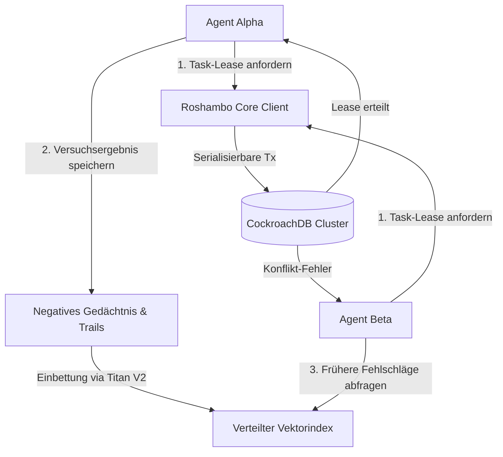
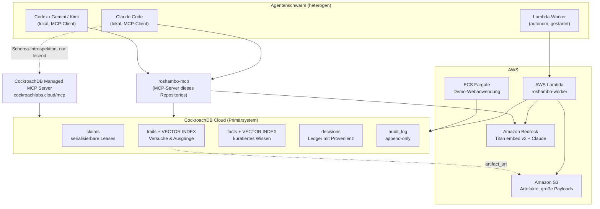

# Roshambo

[](https://github.com/ellmos-ai/roshambo)
[](https://github.com/ellmos-ai)
[](https://github.com/open-bricks)
[](llms.txt)
[](LICENSE)

**der Multi-Agenten-Koordinator**

**[English version / Englische Fassung: README.md](README.md)**


> [!NOTE]
> **KI-Agenten-Integration & LLM-Entdeckbarkeit**: Roshambo bietet eine nativ integrierte MCP-Schnittstelle (`roshambo-mcp`) und strukturierte Speicherinterfaces. Siehe [`llms.txt`](llms.txt) für maschinenlesbaren Kontext, Architekturdetails und Prüfspezifikationen.

**Drei Agenten werfen gleichzeitig. Genau einer gewinnt.
Nicht durch Zufall — durch eine serialisierbare Transaktion.**

Roshambo ist der englische Kurzname für Schere-Stein-Papier: Alle werfen gleichzeitig,
und genau ein Wurf gewinnt. Das ist die Form des Problems, das dieses Projekt für
Agentenschwärme löst — nur entscheidet hier nicht der Zufall, sondern eine
serialisierbare Transaktion in CockroachDB.



> Roshambo ist ein Multi-Agenten-Koordinator. CockroachDB ist das Primärsystem (system
> of record): serialisierbare Leases, damit zwei Agenten nie dieselbe Arbeit
> beanspruchen, und ein verteilter Vektorindex, damit ein Agent fragen kann, bevor er
> beginnt: „Hat das schon einmal jemand versucht — and wie ist es ausgegangen?"


Roshambos zweite Eigenschaft, neben der Koordination, ist das **negative Gedächtnis**:
Es speichert nicht in erster Linie Dokumente oder Konversationen, sondern die *Ausgänge
von Versuchen* — Fehlschläge eingeschlossen — und macht es möglich, den früheren Versuch
später wiederzufinden, selbst wenn eine neue Anfrage anders formuliert ist als der
ursprüngliche Eintrag. Ein Mensch erinnert sich an seine eigenen Sackgassen; ein frisch
gestarteter Agent tut das nicht, es sei denn, jemand hat es aufgeschrieben. (Das ist
Vektorsuche über Embeddings — siehe [Bekannte Einschränkungen](#bekannte-einschränkungen)
für das, was zur Bedeutungserfassung bislang tatsächlich verifiziert ist und was nicht.)

Gebaut für den [CockroachDB x AWS Hackathon: Build with Agentic Memory](https://cockroachdb-ai.devpost.com/)
(Cockroach Labs, durchgeführt über Devpost).

## Positionierung: ein Multi-Agenten-Koordinator, kein Agentengedächtnis-Produkt

Agentengedächtnis ist kein offenes Feld. Mehrere gut gebaute, gut dokumentierte Systeme
decken es bereits ab:

- **[Amazon Bedrock AgentCore Memory](https://docs.aws.amazon.com/bedrock-agentcore/latest/devguide/memory.html)**
  — ein vollständig verwalteter Agentengedächtnis-Dienst: Kurzzeit-Ereignisspeicherung
  innerhalb einer Session, plus Langzeitgedächtnis, das über konfigurierbare Strategien
  (semantisch, summarisierend, Nutzerpräferenzen, episodisch) extrahiert und über
  semantische Suche sitzungsübergreifend abrufbar wird.
- **[`langchain-cockroachdb`](https://github.com/cockroachdb/langchain-cockroachdb)**
  (offiziell) — ein Vectorstore und ein LangGraph-Checkpointer (`CockroachDBSaver`,
  `AsyncCockroachDBSaver`) für thread-gebundenen Agent-State, auf derselben Datenbank,
  die auch Roshambo nutzt.
- **[Memori Labs × CockroachDB](https://www.cockroachlabs.com/blog/agent-memory-database-cockroachdb-memori/)**
  — eine Gedächtnisschicht für Agenten-Fakten, -Ereignisse und -Embeddings, ebenfalls
  auf CockroachDB aufgebaut.
- **[Amazon Bedrock Multi-Agent Collaboration](https://docs.aws.amazon.com/bedrock/latest/userguide/agents-multi-agent-collaboration.html)**
  — ein Supervisor-Muster für bis zu 10 Collaborator-Agenten innerhalb eines
  Bedrock-Kontos, mit `conversationHistory`-Sharing zwischen Supervisor und
  Collaborators.
- **[Claude Code Agent Teams](https://code.claude.com/docs/en/agent-teams)** — eine
  geteilte Aufgabenliste, Peer-to-Peer-Nachrichten und File-Locking zwischen Teammitgliedern
  innerhalb einer Claude-Code-Session.

Roshambo tritt gegen keines dieser Systeme auf dessen eigenem Feld an und baut nicht
nach, was sie bereits gut lösen. **Roshambo ist ein Multi-Agenten-Koordinator: die
Koordinationsschicht zwischen Agenten, die einander nicht kennen** — verschiedene
Hersteller, verschiedene Maschinen, verschiedene Sessions — plus das Gedächtnis darüber,
wie ihre Versuche ausgegangen sind.

| Eigenschaft | Agent Teams | Bedrock Multi-Agent Collaboration | AgentCore Memory | Roshambo |
|---|---|---|---|---|
| Reichweite | eine Session, ein Prozess, ein Hersteller | Bedrock-Agenten innerhalb eines Kontos | Agenten auf AgentCore | herstellerübergreifend, maschinenübergreifend |
| Lebensdauer der Koordination | endet mit der Session | Konversationskontext | — | dauerhaft in der Datenbank, überlebt einen Prozessabsturz |
| Was koordiniert wird | Dateien im Team | Aufgaben, Supervisor an Collaborator | — | beliebige benannte Ressourcen (Repos, Dateien, Cloud-Ressourcen, Datensätze) |
| Auskunft „wer arbeitet woran", von außen gefragt | teamintern | teamintern | — | jeder Beteiligte kann fragen, auch ein Mensch |
| Erinnerung an Ausgänge von Versuchen | nein | nein | Konversationsextraktion | ja, per Vektorsuche auffindbar auch bei Umformulierung, Fehlschläge eingeschlossen |

Ehrlich zur Grenze: Wer eigentlich Konversationsgedächtnis oder thread-gebundenen
Agent-State braucht, sollte die offiziellen Integrationen oben nutzen — Roshambo baut
sie nicht nach und ist zu ihnen komplementär, kein Ersatz (derselbe CockroachDB-Cluster
kann beides zugleich bedienen).

**Warum diese Lücke offen bleibt:** Kein Hersteller hat ein Interesse daran,
Koordination für die Agenten der Konkurrenz zu bauen. Agent Teams koordiniert
Claude-Code-Sessions, Bedrock Multi-Agent Collaboration koordiniert Bedrock-Agenten.
Verbreitete Praxis ist aber gerade, mehrere dieser Werkzeuge nebeneinander im selben
Projekt einzusetzen. Genau dieser Zwischenraum — in dem ein Agent des einen Herstellers
wissen müsste, was ein Agent eines anderen Herstellers bereits versucht hat — ist der
Raum, den Roshambo besetzt.

## Warum CockroachDB

Die zentrale Frage des Hackathons ist, ob CockroachDB eine bedeutsame,
produktionsreife Rolle spielt — nicht eine austauschbare. Roshambo braucht zwei Dinge
gleichzeitig, in **einer** Datenbank:

| Anforderung | Warum ein reiner Vectorstore nicht genügt | Warum eine reine relationale Datenbank nicht genügt |
|---|---|---|
| Zwei Agenten dürfen niemals dieselbe Ressource beanspruchen | Vectorstores bieten keine serialisierbaren Transaktionen | — |
| „Wurde das schon versucht?" muss semantisch beantwortbar sein | — | Eine Datenbank ohne Vektorindex liefert nur Volltext-Nähe |
| Ein Claim (Lease) und eine Erinnerung (Trail) müssen konsistent zueinander bleiben | Ein separater Vectorstore erzeugt genau die „Konsistenzlücke", vor der das Hackathon-Briefing warnt | Dasselbe Problem, dieselbe Richtung |
| Agenten entstehen weltweit und schreiben ständig | — | Eine Single-Region-Datenbank wird zum Ausfallpunkt: „ein Agent, dessen Gedächtnis offline geht, degradiert nicht sanft, er bleibt stehen" |

Das ist ein Fall, der Serializable Isolation *und* einen verteilten Vektorindex
tatsächlich zusammen braucht — kein Fall, in dem CockroachDB gegen etwas anderes
austauschbar wäre.

## Architektur



Zwei MCP-Pfade auf denselben Cluster, bewusst getrennt gehalten:

- **CockroachDB Managed MCP Server** (`https://cockroachlabs.cloud/mcp`) — der
  menschennahe Pfad: Schema-Introspektion, Ad-hoc-Analyse, standardmäßig nur lesend.
  Siehe [`docs/mcp-managed.md`](docs/mcp-managed.md).
- **`roshambo-mcp`** (dieses Repository) — der agentennahe Pfad: eine schmale, geprüfte
  Menge von sechs Verben, kein Werkzeug für freies SQL. Siehe
  [Sicherheit](#sicherheit-kein-freies-sql-mit-absicht) weiter unten.

## Stand

Dieses Repository wurde innerhalb eines festen Hackathon-Einreichungsfensters gebaut,
wobei Kerndatenmodell, AWS-Integration und Agenten-Schnittstelle parallel als getrennte
Arbeitsstränge entwickelt wurden. Jeder Arbeitsstrang führt sein eigenes
Evidenzprotokoll mit tatsächlich ausgeführten Befehlen und deren realer Ausgabe — vor
jeder Behauptung in diesem README lohnt sich ein Blick dorthin:

- Kerndatenmodell, Leases, Recall: [`docs/EVIDENCE-core.md`](docs/EVIDENCE-core.md)
- AWS-Integration (Bedrock, Lambda, S3): [`docs/EVIDENCE-aws.md`](docs/EVIDENCE-aws.md)
- MCP-Server und Agent Skills: [`docs/EVIDENCE-iface.md`](docs/EVIDENCE-iface.md)

In diesem Repository implementiert, mit Tests:

- CockroachDB-Schema (`claims`, `trails`, `facts`, `decisions`, `audit_log`) mit einem
  `VECTOR(1024)`-Index auf `trails`/`facts`, vorangestellt mit `swarm_id` —
  `schema/001_init.sql`
- Der `Roshambo`-Client: `claim` / `release` / `remember` / `recall` / `decide` /
  `status`, plus `heartbeat`, `who_has`, `learn`, `reinforce` — `src/roshambo/memory.py`
- Embeddings: Amazon Titan Text Embeddings V2 über Bedrock, mit einem Offline-Fallback,
  der explizit nicht-semantisch ist, für die Entwicklung ohne AWS-Zugangsdaten —
  `src/roshambo/embeddings.py`
- `roshambo-worker`, ein AWS-Lambda-Handler, der den Zyklus claim → recall → work →
  remember → release umsetzt — `src/roshambo/aws/worker.py`
- S3-Artefaktspeicher für große Trail-/Fact-Payloads — `src/roshambo/aws/s3.py`
- `roshambo-mcp`, der Sechs-Werkzeuge-MCP-Server, den dieses Dokument größtenteils
  beschreibt — `src/roshambo/mcp/server.py`
- Agent Skills, die einem Agenten beibringen, Roshambo korrekt zu nutzen — `skills/`
- CI (`.github/workflows/ci.yml`): Lint plus die zugangsdatenfreie Testsuite, bei jedem
  Push und Pull Request gegen `main`

Im Baum vorhanden und von der AWS-Lane im direkten Test als funktionierend gemeldet,
aber zum Zeitpunkt dieses Schreibens noch nicht in
[`docs/EVIDENCE-aws.md`](docs/EVIDENCE-aws.md) ausgeschrieben — als glaubhaft, aber noch
nicht unabhängig dokumentiert zu behandeln:

- Infrastructure-as-Code / Provisioning-Skripte (`infra/`) — Lambda-Packaging und
  -Deployment, IAM-Policy, `ccloud`-basiertes Cluster-Provisioning
- Die Demo-Webanwendung (`demo/`) — ein FastAPI-Dienst mit statischem Frontend und
  einem `mock`-Modus-Fallback, wenn kein CockroachDB-Cluster konfiguriert ist

Zum Zeitpunkt dieses Schreibens noch nicht begonnen:

- Eine gehostete Demo-URL und das Einreichungsvideo

## Schnellstart

Erfordert Python >= 3.10 und einen erreichbaren CockroachDB-Cluster (eine lokale
`cockroach demo`- / `cockroach start-single-node`-Instanz oder ein CockroachDB-Cloud-Cluster
funktionieren beide — Roshambo braucht nur einen Standard-PostgreSQL-Wire-DSN).

```bash
git clone <this-repository-url>
cd roshambo
pip install -e ".[dev]"          # bei Bedarf Extras ergänzen: [aws] für boto3, [mcp] für den MCP-Server

export ROSHAMBO_DSN="postgresql://root@127.0.0.1:26257/roshambo?sslmode=disable"
export ROSHAMBO_SWARM_ID="demo"

roshambo init-schema     # legt Tabellen und Vektorindizes an; sicher erneut ausführbar
roshambo status          # swarm=demo agents=0 active_claims=0 trails=0 failures=0 facts=0
```

`127.0.0.1` statt `localhost` im DSN verwenden: Auf mindestens einem getesteten Host
löste `localhost` zuerst zu `::1` auf, während ein Cluster mit
`start-single-node --listen-addr=localhost` nur auf `127.0.0.1` lauscht — das kostete
gemessen rund 8 Sekunden gescheiterten IPv6-Handshake pro Verbindung (siehe
[`docs/EVIDENCE-core.md`](docs/EVIDENCE-core.md)). Beide Adressen funktionieren, eine ist
pro Verbindung deutlich langsamer.

`roshambo` ist eine bewusst schmale CLI über denselben Verben wie `roshambo-mcp`
(`claim`, `release`, `who-has`, `remember`, `recall`, plus `init-schema` und `status`) —
siehe `src/roshambo/cli.py`. Auch dort gibt es kein „beliebiges SQL ausführen"-Subkommando.
`init-schema` akzeptiert zusätzlich `--repair-vector-indexes`, das einen Vektorindex
neu baut, dessen Operatorklasse nicht zu dem passt, womit `recall()` abfragt — nur
nötig, wenn `trails`/`facts` von einer älteren Revision von `schema/001_init.sql`
angelegt wurden; siehe [Bekannte Einschränkungen](#bekannte-einschränkungen), warum
diese Abweichung wichtig ist.

Den MCP-Server direkt starten (stdio-Transport):

```bash
roshambo-mcp
```

Ihn aus Claude Code als lokalen stdio-Server verbinden, mit der Umgebung, die er braucht:

```bash
claude mcp add --transport stdio roshambo \
  --env ROSHAMBO_DSN="postgresql://root@localhost:26257/roshambo?sslmode=disable" \
  --env ROSHAMBO_SWARM_ID="demo" \
  -- roshambo-mcp
```

Danach in Claude Code `/mcp` ausführen, um zu bestätigen, dass die Verbindung steht und
sechs Werkzeuge gelistet werden.

## In Aktion sehen

Es gibt eine kleine Web-Anwendung, die einen laufenden Schwarm zeigt — wer welchen Lease
hält, wer abgewiesen wurde und von wem, dazu ein `recall()`-Suchfeld — und ein Skript, das
das vierteilige Demo-Szenario gegen einen echten Cluster spielt, Schlag für Schlag:

```bash
pip install -r demo/requirements.txt
export ROSHAMBO_EMBEDDING_PROVIDER="placeholder"   # siehe Hinweis unten
python demo/serve.py --dev                          # http://127.0.0.1:8000/

python demo/run_story.py --beat 1   # drei Agenten kollidieren; ein Lease, zwei begründete Absagen
python demo/run_story.py --beat 2   # der Gewinner läuft in eine Sackgasse und hält das fest
python demo/run_story.py --beat 3   # eine neue Sitzung findet diesen Fehlschlag und wählt einen anderen Weg
python demo/run_story.py --beat 4   # ein Halter verstummt; der Lease läuft ab und wird übernommen
```

Vollständige Anleitung samt dem, was während jedes Schlags auf dem Bildschirm passiert:
[`demo/README.md`](demo/README.md). Screenshots des Laufs gegen einen CockroachDB-Cloud-
Cluster: [`docs/screenshots/`](docs/screenshots/).

Die Abnahmezahl für die Koordinationsaussage ist gemessen, nicht behauptet:
`python demo/run_story.py --measure --rounds 10` lässt drei Agenten zehnmal um dieselbe
Ressource laufen und prüft je Runde auf genau einen Gewinner, genau zwei Absagen und darauf,
dass jede Absage den tatsächlichen Gewinner nennt. Zehn von zehn Runden bestanden gegen den
Cloud-Cluster; drei verschiedene Laufzeiten gewannen. Methode, Zahlen und das, was *nicht*
aufging, stehen in [`docs/EVIDENCE-demo.md`](docs/EVIDENCE-demo.md).

Zwei Dinge, die man vor einer Aufnahme oder Bewertung wissen sollte:

* Die App **fällt auf gekennzeichnete Mock-Daten zurück**, sobald sie keinen Cluster
  erreicht, statt abzustürzen. Vorher `curl http://127.0.0.1:8000/api/health` auf
  `"mode":"live"` prüfen; die Seite zeigt im Mock-Modus außerdem ein Banner.
* `ROSHAMBO_EMBEDDING_PROVIDER=placeholder` wählt den Offline-Embedder, der nach
  **lexikalischer Überschneidung** rangiert (Worttoken und Zeichen-Trigramme). Er ist der
  einzige Offline-Embedder mit brauchbarem Retrieval-Signal, aber kein semantisches Modell
  — siehe [Bekannte Einschränkungen](#bekannte-einschränkungen).

## Konfiguration

Alles wird aus der Umgebung unter dem Präfix `ROSHAMBO_` gelesen (`src/roshambo/config.py`),
sodass dieselbe Konfiguration in einer Shell, in `roshambo-mcp` und in einer Lambda
funktioniert:

| Variable | Erforderlich | Standard | Bedeutung |
|---|---|---|---|
| `ROSHAMBO_DSN` | ja | — | PostgreSQL-Wire-Verbindungsstring zu CockroachDB |
| `ROSHAMBO_SWARM_ID` | nein | `default` | Mandanten-/Präfixschlüssel; führende Spalte jedes Tabellen-Primärschlüssels und des Vektorindex |
| `ROSHAMBO_EMBEDDING_DIM` | nein | `1024` | Vektordimension (muss zu den `VECTOR(n)`-Spalten des Schemas passen) |
| `ROSHAMBO_LEASE_TTL_SECONDS` | nein | `300` | Standard-Lebensdauer eines Claims |
| `ROSHAMBO_EMBEDDING_PROVIDER` | nein | `bedrock` | Welcher Embedder genutzt wird: `bedrock` (echt) oder `local` (Offline-Hash, ohne Retrieval-Signal). `Roshambo(cfg)` akzeptiert zusätzlich `placeholder` für den lexikalischen Offline-Embedder; `roshambo.embeddings.get_embedder` — und damit der Lambda-Worker — nicht |
| `ROSHAMBO_AWS_REGION` | nein | `us-east-1` | Region für Bedrock- und S3-Aufrufe |
| `ROSHAMBO_BEDROCK_MODEL_ID` | nein | `amazon.titan-embed-text-v2:0` | Bedrock-Embedding-Modell |
| `ROSHAMBO_S3_BUCKET` | nein | nicht gesetzt | Bucket für Artefaktspeicher; nur erforderlich bei Nutzung von `put_artifact` |

## Die sechs Werkzeuge

`roshambo-mcp` bietet genau diese sechs Verben — nicht mehr, und kein Werkzeug für freie
Abfragen außer `recall`s eingebetteter Vektorsuche:

| Werkzeug | Zweck |
|---|---|
| `claim(resource, agent_id, intent, ttl_seconds?)` | Nimmt ein exklusives, serialisierbares Lease. Eine Ablehnung (`ClaimDenied`) nennt, wer es hält und was beabsichtigt ist — ein normales Ergebnis, kein Fehler, der blind wiederholt werden sollte. |
| `release(claim_id)` | Gibt einen Claim frei, damit ein anderer Agent die Ressource übernehmen kann. |
| `remember(topic, approach, outcome, evidence, ...)` | Zeichnet auf, was versucht wurde und wie es ausging. `outcome` ist eines von `success` / `failure` / `abandoned` / `inconclusive` — Fehlschläge werden genauso geschrieben wie Erfolge. |
| `recall(query, limit?, outcomes?)` | Vektorsuche über vergangene Trails — findet einen früheren Versuch auch dann, wenn die Anfrage anders formuliert ist als der ursprüngliche Eintrag. *Vor* `claim()` aufrufen, bei allem, was nicht offensichtlich Routine ist. |
| `decide(question, choice, rationale, confidence, provenance, ...)` | Protokolliert eine Entscheidung im schwarmweiten Ledger. `provenance` ist Pflicht: Ob tatsächlich ein Mensch beteiligt war, darf nachträglich nie erraten werden. |
| `status()` | Eine Momentaufnahme des Schwarms: Agentenzahl, aktive Claims, Trails, Fehlschläge, Facts. |

## Welches CockroachDB-Werkzeug, wofür

Der Hackathon verlangt von Einreichungen, mindestens zwei der vier unten stehenden
CockroachDB-Werkzeuge zu nutzen und zu benennen, was der Agent tatsächlich damit getan
hat:

| CockroachDB-Werkzeug | Wie Roshambo es nutzt | Wo in diesem Repository |
|---|---|---|
| **Distributed Vector Indexing** | `trails` und `facts` tragen eine `VECTOR(1024)`-Spalte mit einem `VECTOR INDEX`, vorangestellt mit `swarm_id`; `recall()` fragt ihn mit Kosinusdistanz (`<=>`) ab, damit ein Agent vor dem Handeln prüfen kann, ob ein Ansatz bereits gescheitert ist | `schema/001_init.sql`, `src/roshambo/memory.py` (`recall`), `tests/test_core_recall.py` |
| **CockroachDB Cloud Managed MCP Server** | Der nur lesende Inspektionspfad für Schema-Introspektion und Ad-hoc-Analyse, bewusst getrennt von `roshambo-mcp`s schmalem Schreibpfad | [`docs/mcp-managed.md`](docs/mcp-managed.md) |
| **Agent Skills Repo** | Roshambo liefert eigene Skills im selben `SKILL.md`-Format wie `cockroachlabs/cockroachdb-skills` und dokumentiert, wie dieses Repository zusätzlich installiert wird | `skills/`, [`docs/skills.md`](docs/skills.md) |
| **ccloud CLI** | Geplant: Cluster-, Service-Account- und Backup-Provisioning, von der Agentenseite gesteuert | `infra/` (siehe [Stand](#stand)) |

## Welcher AWS-Dienst, wofür

| AWS-Dienst | Wie Roshambo ihn nutzt | Wo in diesem Repository |
|---|---|---|
| **Amazon Bedrock** | Titan Text Embeddings V2 (1024-dimensional) embedded jeden Trail und jedes Fact, bevor es nach CockroachDB geschrieben wird; ein Offline-Embedder, der explizit nicht-semantisch ist, springt ein, wenn keine AWS-Zugangsdaten konfiguriert sind, damit der Rest des Systems trotzdem läuft | `src/roshambo/embeddings.py` |
| **AWS Lambda** | `roshambo-worker`: ein autonomer Handler, der eine Ressource beansprucht, das Gedächtnis prüft, eine Arbeitseinheit erledigt und zurückschreibt, was passiert ist — die Hälfte des Briefings zu „Agenten entstehen autonom und schreiben ständig" | `src/roshambo/aws/worker.py` |
| **Amazon S3** | Große Trail-/Fact-Payloads werden per `s3://`-Referenz (`artifact_uri`) gespeichert statt inline in CockroachDB-Zeilen | `src/roshambo/aws/s3.py` |
| **Amazon ECS Fargate** *(optional)* | Geplantes Hosting für die Demo-Webanwendung | `demo/` (siehe [Stand](#stand)) |

## Sicherheit: kein freies SQL, mit Absicht

`roshambo-mcp` stellt kein Werkzeug bereit, das rohes SQL entgegennimmt, auch kein
allgemeines „Query"-Argument über `recall`s eingebettete Vektorsuche hinaus. Das
ist eine bewusste Grenze, kein Versehen: Ein Agent, der beliebiges SQL schreiben kann,
kann Roshambos Invarianten verletzen — ein Lease freigeben, das er nie hielt, einen
Trail ohne Evidenz schreiben, die verpflichtende `provenance` bei einer Entscheidung
überspringen. Ad-hoc-Inspektion und Analytics gehören stattdessen zum
**CockroachDB Managed MCP Server** (standardmäßig nur lesend, vollständiges
Audit-Logging, kein eigener Proxy) — siehe [`docs/mcp-managed.md`](docs/mcp-managed.md).
`roshambo-mcp` bleibt der geprüfte, schmale Schreibpfad.

Jeder Aufruf über `claim` / `release` / `remember` / `recall` / `decide` wird zusätzlich
an eine append-only `audit_log`-Tabelle angehängt (`swarm_id`, `agent_id`, Verb,
Ressource, `allowed`, `reason`, `latency_ms`) als zweite, unabhängige Aufzeichnung
dessen, was der Schwarm getan hat — siehe `Roshambo._audit` in `src/roshambo/memory.py`.

## Bekannte Einschränkungen

- **Vektoren werden zeilenweise eingefügt.** CockroachDB dokumentiert, dass
  Batch-Inserts die Qualität des Vektorindex verschlechtern, daher haben
  `remember()`/`learn()` keine Bulk-Insert-Variante.
- **`IMPORT INTO` wird auf Tabellen mit Vektorindex nicht unterstützt**; jegliche
  Seed-Daten laufen über normale zeilenweise Inserts.
- **Ein Vektorindex beschleunigt nur Abfragen, die auf seiner Präfixspalte filtern** —
  `recall()` filtert deshalb immer zuerst auf `swarm_id`.
- **Ein Vektorindex mit falscher Operatorklasse wird stillschweigend nicht mehr
  genutzt.** `CREATE VECTOR INDEX` ohne explizite Operatorklasse setzt standardmäßig
  `vector_l2_ops`, was CockroachDB für `recall()`s Kosinus-Operator `<=>` nicht nutzt —
  die Abfrage liefert weiterhin korrekte Zeilen, scannt aber unsichtbar die ganze
  Tabelle, bis jemand `EXPLAIN` ausführt (siehe
  [`docs/feedback-to-cockroachlabs.md`](docs/feedback-to-cockroachlabs.md), Punkt 1, und
  [`docs/EVIDENCE-core.md`](docs/EVIDENCE-core.md) für einen Lauf, der genau das bei
  einer von einer älteren Schema-Revision angelegten Tabelle traf). `roshambo
  init-schema --repair-vector-indexes` erkennt und repariert einen unpassenden Index;
  `apply_schema` bricht seither mit Fehler ab, statt still weiterzulaufen, wenn es einen
  findet.
- **Der Offline-`DeterministicEmbedder` ist kein semantisches Modell.** Er existiert
  nur, damit der Rest des Systems ohne AWS-Zugangsdaten läuft, und darf niemals mit
  Bedrocks echten Embeddings verwechselt werden — weder in einer Demo noch in
  Ergebnissen.
- **Der bisher getestete `recall()`-Abruf ist lexikalisch, nicht semantisch.** Gegen
  einen echten CockroachDB-Knoten findet eine umformulierte Anfrage einen gespeicherten
  Fehlschlag tatsächlich auf Rang eins wieder — aber das Evidenzprotokoll führt dieses
  Ergebnis auf gemeinsame Wörter und Zeichen-Trigramm-Überlappung zurück, nicht auf eine
  verifizierte Bedeutungserfassung (siehe
  [`docs/EVIDENCE-core.md`](docs/EVIDENCE-core.md)). Der Amazon-Titan-Embedding-Pfad, der
  den Abruf tatsächlich semantisch machen würde, ist implementiert, wurde aber in dieser
  Umgebung noch nicht mit AWS-Zugangsdaten ausgeführt (`test_recall_with_the_real_embedder`
  in `tests/test_core_recall.py`, aktuell übersprungen). Bis dieser Test gelaufen ist,
  sollte keine Aussage in diesem Dokument als „recall versteht Bedeutung" gelesen werden
  — nur als „recall findet einen früheren Eintrag auch bei anderer Formulierung wieder".
- Dieses README behauptet keine Performance- oder Skalierungszahlen; die unter
  [Stand](#stand) verlinkten Evidenzdokumente zeigen, was tatsächlich gemessen wurde.

## Agent Skills

`skills/` enthält Roshambos eigene [Agent Skills](https://github.com/cockroachlabs/cockroachdb-skills)
(`SKILL.md`-Format), die einem Agenten die zwei Gewohnheiten beibringen, auf die
Roshambo angewiesen ist: `recall()` aufrufen, bevor unbekannte Arbeit begonnen wird, und
Lease-Disziplin (claim/heartbeat/release) einhalten. [`docs/skills.md`](docs/skills.md)
dokumentiert beide Skills und wie zusätzlich `cockroachlabs/cockroachdb-skills` für
allgemeines CockroachDB-Betriebswissen eingebunden wird.

## Entwicklung

```bash
pip install -e ".[dev]"
pytest                 # Tests, die einen laufenden Cluster brauchen, sind mit `live`
                        # markiert und werden ohne ROSHAMBO_DSN sauber übersprungen;
                        # siehe tests/conftest.py
ruff check .
```

## Lizenz

Apache License 2.0 — siehe [LICENSE](LICENSE) und [NOTICE](NOTICE).
